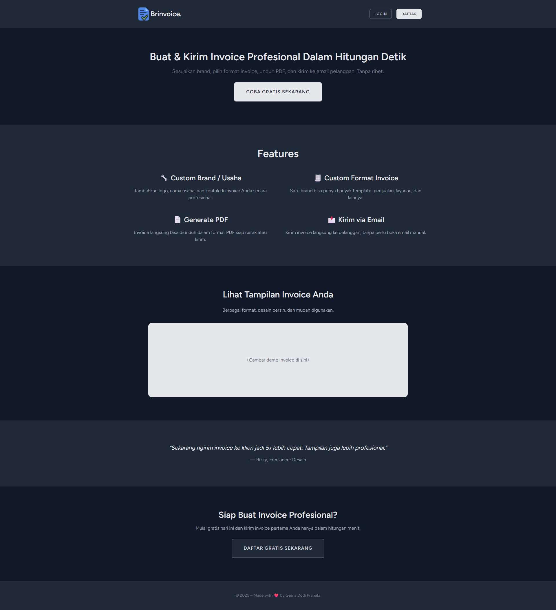

# Brinvoice

A web app anyone can use to make invoices.

## Features

- Custom brand/business → Invoice issued under the name of a specific company/brand
- Custom invoice format → A single brand can have multiple invoice formats (e.g., services, sales, etc.)
- Generate PDF → Invoices can be downloaded in PDF format
- Send Email → Invoices can be sent to the customer's email address


## Screenshots




## Built with

- php 8.3
- Laravel 12 
- Nginx
- Sqlite
- Laravel Breeze with Alpine.js (Authentication and Authorization)
- Spatie/laravel-pdf with Puppeteer to generate PDF from views
- [Mailtrap](https://mailtrap.ioa/) is used to catch emails sent from your app while you're still developing or testing it (use Mailgun when you're in production).


## Run Locally

Clone the project

```bash
  git clone https://github.com/gemadp01/brinvoice.git
```

Go to the project directory

```bash
  cd brinvoice
```

Install dependencies

```bash
  npm install
  composer install
```

Copy .env from .env.example

```bash
  copy .env.example .env
```

Set the filesystem disk to public in the .env file and link the storage

```bash
  FILESYSTEM_DISK=public
  php artisan storage:link
```

Sign up for Mailtrap, then integrate the sandbox with Laravel 9+ using the code samples. Copy them into the .env file (adjust as needed).

```bash
  MAIL_MAILER=smtp
  MAIL_HOST=sandbox.smtp.mailtrap.io
  MAIL_PORT=xxxx
  MAIL_USERNAME=xxx
  MAIL_PASSWORD=xxx
```

Migrate database

```bash
  php artisan migrate
```

Start the server

```bash
  npm run dev
  php artisan serve
```


## Feedback

If you have any feedback, please reach out to me at gemadp01@gmail.com


## Authors

- [@gemadp01](https://www.github.com/gemadp01)

